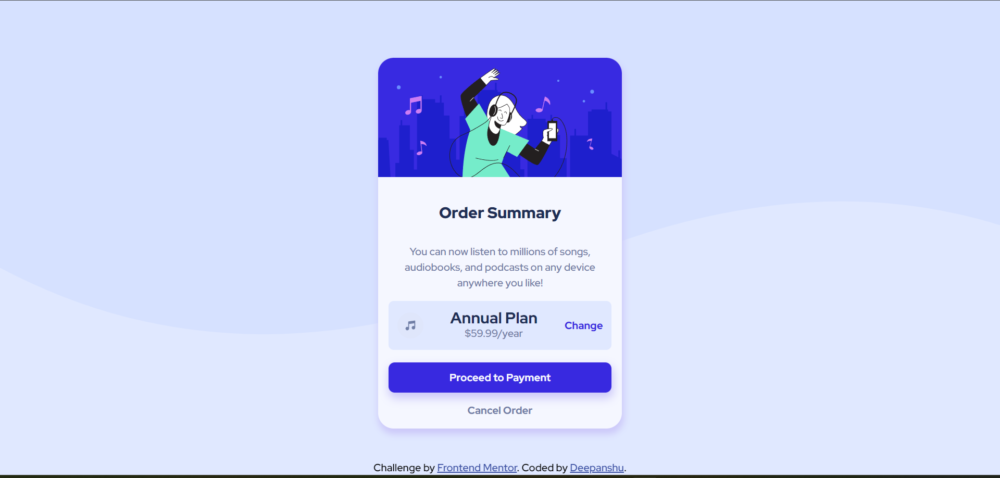
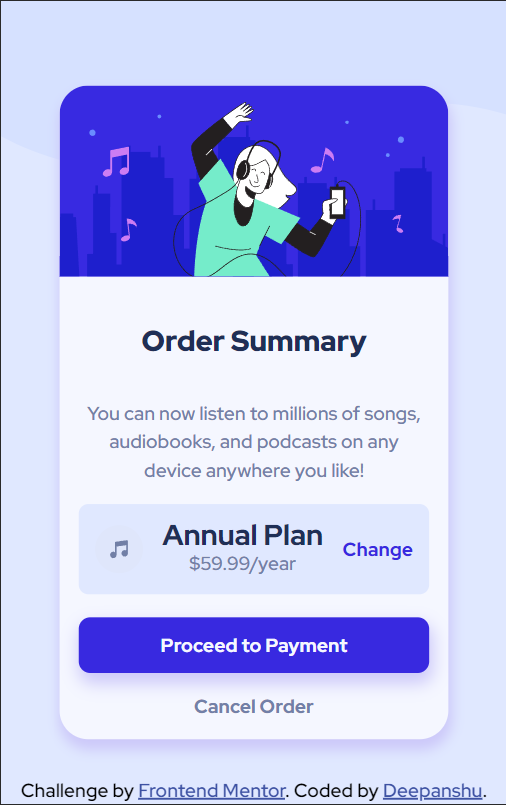

# Frontend Mentor - Order summary card solution

This is a solution to the [Order summary card challenge on Frontend Mentor](https://www.frontendmentor.io/challenges/order-summary-component-QlPmajDUj). Frontend Mentor challenges help you improve your coding skills by building realistic projects. 

## Table of contents

- [Overview](#overview)
  - [The challenge](#the-challenge)
  - [Screenshot](#screenshot)
  - [Links](#links)
- [My process](#my-process)
  - [Built with](#built-with)
  - [What I learned](#what-i-learned)
  - [Continued development](#continued-development)
  - [Useful resources](#useful-resources)
- [Author](#author)
- [Acknowledgments](#acknowledgments)

## Overview

### The challenge

Users should be able to:

- See hover states for interactive elements

## Screenshot
### Desktop view

### Mobile view

### Links

- Solution URL: [(https://github.com/DDeepanshu99/order-summary-component-solution)]
- Live Site URL: [(https://ddeepanshu99.github.io/order-summary-component-solution/)]

## My process

### Built with

- Semantic HTML5 markup
- CSS custom properties
- Flexbox

### What I learned

I really struggled with the background, for some reason my background was not covering up the entire webpage and because of it i had to do some tweaks around the image but still it is not perfect. Getting the right box-shadow was also a little tricky. It took me a lot of googling and reading through mdn docs to finally get it somewhat right.
My friend raghav [https://www.frontendmentor.io/profile/Rgulati4657] also helped me a lot.

### Continued development

Although I am still currently learning css, I felt this was a nice project to practice. I still have to work on my flexbox and grid layouts. 

### Useful resources

- [(https://developer.mozilla.org/en-US/)] - This is an amazing resource for learning web dev stuff and whenever i was getting stuck i went here to learn and clear my doubts.

## Author

- GitHub - [(https://github.com/DDeepanshu99)]
- Frontend Mentor - [(https://www.frontendmentor.io/profile/DDeepanshu99)]

## Acknowledgments

I would like to give thanks to Raghav Gulati [https://www.frontendmentor.io/profile/Rgulati4657] to help me with this project.

